# MotorLab

Installing from GitHub

 

## Installation

### Github
Make sure you're signed in on https://github.com/ before you start. To make a fork of this code so that you can edit and keep your own version, click on the "fork" button at the top right (shown below). Leave all of the settings as is and press "fork" again.
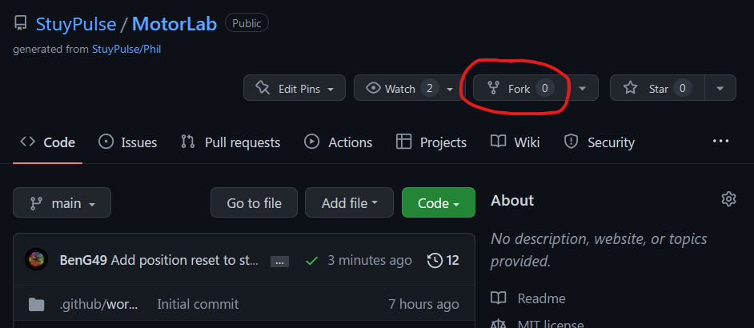

To download your code go back to https://github.com/ and find the new MotorLab that is under YOUR github account. Click on “Code”, then “HTTPS”, and then copy the link.

Open Git Bash (or Terminal if you're on a Mac) and type `git clone <link here>` (in Git Bash you may need to right click and press paste).
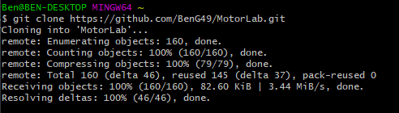
    

Saving to GitHub

 
    
### Push to Github

There are 3 steps to pushing to Github: Adding, Committing, and Pushing.

#### Adding

Before pushing code to github, you have to choose which changes you want to include. VSCode has a git menu, as shown in the picture below. If you want to add the changes from a certain file, you can hover over the file name and click "+". This will bring the changes into the "Staged Changes" section.

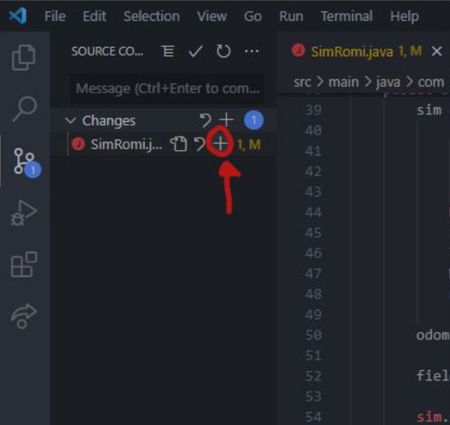

#### Committing

Commits are a way of grouping changes that you're going to push to github. You can add a message to your commit in the text box above "Staged Changes". To commit, click the check mark.

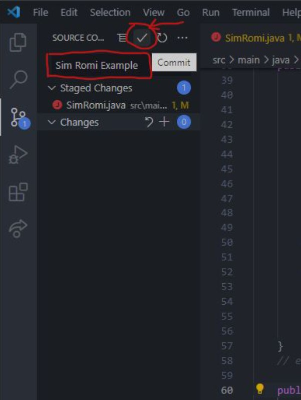

#### Pushing

Once you've committed, all thats left is to sync your local changes with the code online. To do this, press the blue "Sync Changes" button or click on the three dots by "Source Control" and click "Push".

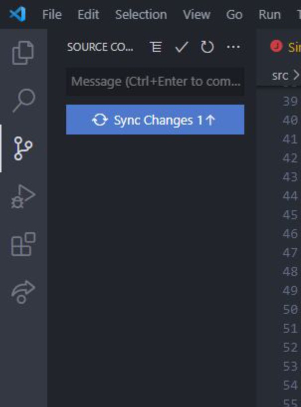

Coding in VSCode

 

### Coding
Once you've cloned your code, open the MotorLab folder in VSCode. The only file you'll be editing is [DriveFunctions.java](src/main/java/com/stuypulse/robot/commands/DriveFunctions.java) (`src/main/java/com/stuypulse/robot/commands/DriveFunctions.java`).
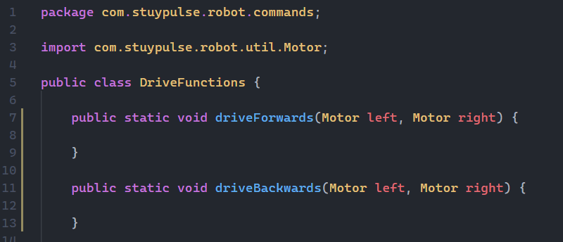
This is what the file should look like (some lines cut). You'll be coding in each section enclosed by `{}`, and depending on which command you run this code will be run continuously in a loop.

For example, the code below will run the left motor at 100% forever when the `Drive Forwards` command is run.
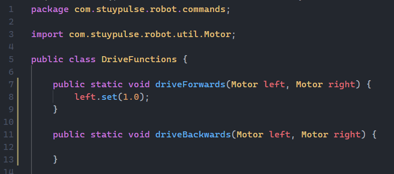

Running in VSCode

 

### Running your code
You can run any of your functions whenever you want to test them in a simulated environment (as long as you aren't on a Mac 😢).

To run your code, press Ctrl+Shift+P or click on the WPILib logo at the top right.

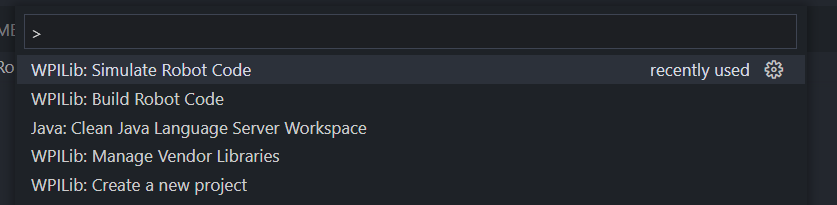

Then select `WPILib: Simulate Robot Code on Desktop`

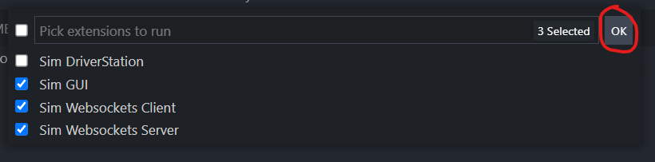

Hit `OK` and the program should start running.
To select which command to run, use the Autonomous drop down shown below and choose your command.

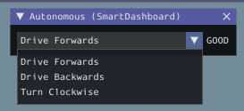

To run the robot, click on "Autonomous" in the robot state selector. To restart, press "Disabled" and then "Autonomous" again.

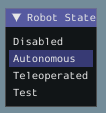

## MotorLab

Motors are the cause of movement on a robot, so understanding how to interact with them in code is fundamental for robot programming. 

In general, motors are devices that convert electrical energy into motion, which is a complicated way of saying that they spin when you power them. As a result, the most common way to get a motor to do something is to give it what's called a *duty cycle*, which is a value between -1.0 and +1.0 which dictates at what percent of full power the motor will spin at. 

These facts about motors are reflected in the code that is used to control them. The most common way motors are controlled in code is by setting their *duty cycle*, usually by something that looks like `motor.set(1.0)`. 

For a robot's drivetrain, motors allow it to move, whether that be through human input or autonomous routines. This lab will guide you through a series of challenges about simple drivetrain motion as well as simple autonomous control using **control theory**.

### Motor Functions
<table>
    <thead>
        <tr>
            <th>Function</th>
            <th>Description</th>
            <th>Returns</th>
        </tr>
    </thead>
    <tbody>
        <tr>
            <td>left.set(x)</td>
            <td rowspan=2>Set the motor percentage to x, a value from 1.0 to -1.0 (1.0 is full speed forwards, -1.0 is full speed backwards).</td>
            <td rowspan=2>nothing (void)</td>
        </tr>
        <tr>
            <td>right.set(x)</td>
        </tr>
        <tr>
            <td>left.getDistance()</td>
            <td rowspan=2>Returns the distance in inches the motor has traveled. NOTE: if the robot moves 3 inches forward and 3 backwards, the distance will be 0.</td>
            <td rowspan=2>double</td>
        </tr>
        <tr>
            <td>right.getDistance()</td>
        </tr>
    </tbody>
</table>

## Challenges:

Using the **Motor Functions** given above, and all the Java knowledge learned (data types, variables, operators, if's and conditionals), complete these challenges within the brackets for a given function. They can be found in the [DriveFunctions.java](src/main/java/com/stuypulse/robot/commands/DriveFunctions.java) file. 

What you code will be run continuously, so you do **NOT** need loops to run these functions. That is handled for you.

Driving
 
Simply get your romi to drive straight! No need to stop it.

Use `void driveForwards(Motor left, Motor right) {}`.

Just like the last command, but backwards:

Use `void driveBackwards(Motor left, Motor right) {}`.

Turning
 
Make your romi turn in-place clockwise (to the right). It should spin around its center.

You'll need to think about this one!

Use `void turnRight(Motor left, Motor right) {}`.

Do it again but counter-clockwise (to the left):

Use `void turnLeft(Motor left, Motor right) {}`.

Basic Autonomy
 
Until this point, the robot has just run infinitely based on what you have hard coded. Let's get it to move a little smarter by having it drive to a distance.

This is considered autonomous motion as the robot is moving without human instruction.

The distance that we want the robot to stop at is called the *setpoint*. Create a variable inside the function that represents the setpoint, and set it to `60.0`. (it can really be anything, but 60 is a good distance). 

Create code that drives forward, but stops once the robot has past its setpoint.

Use `void stopDistance(Motor left, Motor right) {}`.

What you have created is a *control law*, which is a mathematical formula or some logic that will make a robot's *measurement* approach a *setpoint*. 

In our case the *measurement* is the distance travelled by the motors, and the *setpoint* is where we want the motors to be. By telling the motors to drive forward when the *setpoint* has not been reached, we are increasing the measurement until it approaches a setpoint.

A good *control law* is essential for autonomous control. 

    

Bang Bang
 

There are several issues with our first control law. Firstly, if our robot is really heavy and we let it get to a high speed, by the time we tell it to stop, it will simply roll past the *setpoint*. 

A related issue is that the control law does not handle if the robot is in front of its setpoint. If the robot rolls over its setpoint or the setpoint started behind the robot, then it will not tell the robot to not move. 

Write a more advanced control law that can move the robot back to its setpoint, rather than just stopping it. 

Use `void bangBang(Motor left, Motor right) {}`.

This control law is called Bang-Bang.

    

Less Bang
 
Bang Bang will *technically* work, but clearly when you run it, it continually oscillates around the setpoint. It has same issue as our first law, where making sudden changes in direction can be inconsistent and dangerous.

You can change how fast the Bag Bang law runs by simply running the motors at a smaller value (as opposed to -1.0 and +1.0). When the value is smaller, the robot will reach the setpoint slower but there will be smaller oscillations. When the value is higher, the robot reaches the setpoint quickler, but with larger oscillations.

For this Bang Bang version, play around with the value you are sending the motors to find a good balance of response time to oscillations. This is a manual process called *tuning*. 

Use `void lessBang(Motor left, Motor right) {}`

    

Proportional Control
 

We can get inspiration for another control algorithm from real life.

Whenever you're running across the street to not miss the light, you run full speed across the street. As you approach the curb, though, you don't want to run full speed to the mom with her two kids standing there. So, you slow down as you run to the curb. The effort you put into running is proportional to how far you are from the curb.

When we are farthest from the curb, we want to run as fast as possible, but when we are are at the curb we don't want to be moving. In between, we want to slow down.

This can be put into terms we already know. The *setpoint* is the width of the street (initial distance to the curb). The *measurement* is how far you've already run into the street. 

We want to introduce a new term, *error* which is the *setpoint* minus the *measurement*.

When running across the curb, the effort is proportional to error, and when getting a robot to drive to a distance, the *duty cycle* is 
proportional to the error.

Code the control law described above so that when the autonomous routine starts it will calculate `1.0` exactly and will decrease down to `0.0` as the robot drives forward. Once you find this value, scale it up or down as needed to find a good balance between response time and oscillations.

**THERE ARE NO `if` STATEMENTS NECESSARY**

Use `void betterControl(Motor left, Motor right) {}`.

This control algorithm is called a P-Control, which is one component of a greater algorithm called PID-Control.

